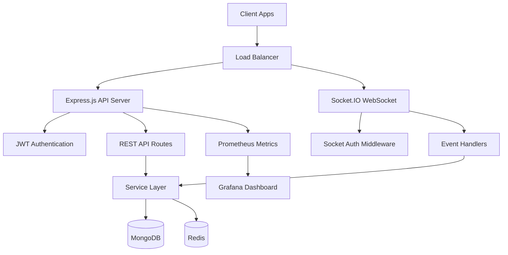

# 🚀 RealtimeHub

Production-ready real-time messaging platform supporting 1:1 and group messaging, built with modern backend architecture.


## Architecture



## Features

### Authentication
- ✅ User Registration & Login
- ✅ JWT Access & Refresh Tokens
- ✅ bcrypt Password Hashing
- ✅ Profile Management
- ✅ Persistent Sessions (Zustand)

### Messaging
- ✅ 1:1 Direct Conversations
- ✅ Group Messaging
- ✅ Send / Edit / Delete Messages
- ✅ **Photo Sharing via Base64**
- ✅ Read Receipts
- ✅ Cursor-based Pagination

### Real-Time (Socket.IO)
- ✅ Instant Message Delivery
- ✅ Typing Indicators
- ✅ Online/Offline Presence
- ✅ Delivery Acknowledgements
- ✅ Auto Room Join/Leave
- ✅ Connection State Recovery

### Group Management
- ✅ Create / Update / Delete Groups
- ✅ Add / Remove Members
- ✅ Admin Roles & Transfer
- ✅ System Messages

### Infrastructure
- ✅ Redis (sessions, presence, caching)
- ✅ Prometheus Metrics
- ✅ Grafana Dashboard
- ✅ Docker & Docker Compose
- ✅ GitHub Actions CI/CD
- ✅ Swagger API Documentation

## Tech Stack

| Layer | Technology |
|-------|-----------|
| Frontend | React 19 + Vite 8 |
| UI/State | Vanilla CSS + Zustand |
| Runtime | Node.js 20 |
| Language | TypeScript 5 |
| Framework | Express.js |
| WebSocket | Socket.IO 4 |
| Database | MongoDB 7 (Mongoose) |
| Cache | Redis 7 (ioredis) |
| Auth | JWT + bcrypt |
| Validation | Zod |
| Logging | Winston |
| Docs | Swagger (OpenAPI 3.0) |
| Metrics | Prometheus + Grafana |
| Container | Docker + Docker Compose |
| CI/CD | GitHub Actions |
| Testing | Jest + Supertest |

## Project Structure

```
src/
├── config/           # App configuration, DB, Redis, Logger
├── controllers/      # Request handlers (thin layer)
├── docs/             # Swagger/OpenAPI setup
├── middlewares/       # Auth, validation, error, metrics
├── models/           # Mongoose schemas
├── routes/           # Express routes with OpenAPI docs
├── services/         # Business logic layer
├── sockets/          # Socket.IO handlers
├── utils/            # Helpers, constants, JWT
├── validators/       # Zod validation schemas
├── app.ts            # Express application
└── server.ts         # Entry point
tests/
├── unit/             # Unit tests
└── integration/      # API integration tests
monitoring/
├── prometheus/       # Prometheus config
└── grafana/          # Grafana dashboards & provisioning
```

## Getting Started

### Prerequisites

- Node.js >= 18
- MongoDB (local or Atlas)
- Redis
- Docker & Docker Compose (optional)

### Option 1: Local Development

```bash
# Clone the repo
git clone <repo-url>
cd realtimehub

# Install dependencies
npm install

# Configure environment
cp .env.example .env
# Edit .env with your MongoDB URI, Redis URL, JWT secrets

# Start development server (requires MongoDB & Redis running)
npm run dev
```

The server starts at `http://localhost:3000`.

### Option 2: Docker Compose (Recommended)

*(Note: Requires Docker Desktop to be installed and running. If using a newer Docker version on Mac, use `docker compose` instead of `docker-compose`)*

```bash
# Start all services (React Frontend + Node Backend)
docker compose up --build -d
```

| Service | URL |
|---------|-----|
| **Frontend App** | http://localhost:5173 |
| API | http://localhost:3000 |
| Swagger Docs | http://localhost:3000/api-docs |
| Health Check | http://localhost:3000/health |
| Metrics | http://localhost:3000/metrics |

## API Endpoints

### Authentication
| Method | Endpoint | Description |
|--------|----------|-------------|
| POST | `/api/auth/register` | Register new user |
| POST | `/api/auth/login` | Login |
| POST | `/api/auth/logout` | Logout |
| POST | `/api/auth/refresh` | Refresh tokens |
| GET | `/api/auth/profile` | Get profile |
| PUT | `/api/auth/profile` | Update profile |

### Users
| Method | Endpoint | Description |
|--------|----------|-------------|
| GET | `/api/users` | Search users |
| GET | `/api/users/:id` | Get user by ID |

### Chats
| Method | Endpoint | Description |
|--------|----------|-------------|
| POST | `/api/chats` | Create conversation |
| GET | `/api/chats` | List conversations |
| GET | `/api/chats/:id` | Get conversation |
| GET | `/api/chats/:id/messages` | Get messages |
| POST | `/api/chats/:id/messages` | Send message |
| PUT | `/api/chats/:id/messages/:messageId` | Edit message |
| DELETE | `/api/chats/:id/messages/:messageId` | Delete message |
| POST | `/api/chats/:id/read` | Mark as read |

### Groups
| Method | Endpoint | Description |
|--------|----------|-------------|
| POST | `/api/groups` | Create group |
| GET | `/api/groups/:id` | Get group |
| PUT | `/api/groups/:id` | Update group |
| DELETE | `/api/groups/:id` | Delete group |
| POST | `/api/groups/:id/members` | Add members |
| DELETE | `/api/groups/:id/members/:memberId` | Remove member |
| POST | `/api/groups/:id/leave` | Leave group |
| GET | `/api/groups/:id/messages` | Get group messages |

## Socket.IO Events

### Client → Server
| Event | Payload | Description |
|-------|---------|-------------|
| `message:send` | `{ conversationId, content, type? }` | Send message |
| `message:edit` | `{ messageId, content }` | Edit message |
| `message:delete` | `{ messageId }` | Delete message |
| `message:read` | `{ conversationId }` | Mark as read |
| `typing:start` | `{ conversationId }` | Start typing |
| `typing:stop` | `{ conversationId }` | Stop typing |
| `conversation:join` | `{ conversationId }` | Join room |
| `conversation:leave` | `{ conversationId }` | Leave room |

### Server → Client
| Event | Payload | Description |
|-------|---------|-------------|
| `message:new` | `Message` | New message |
| `message:updated` | `Message` | Edited message |
| `message:deleted` | `{ messageId, conversationId }` | Deleted message |
| `message:delivered` | `{ messageId, conversationId }` | Delivery ack |
| `message:read` | `{ conversationId, userId, readAt }` | Read receipt |
| `user:online` | `{ userId }` | User online |
| `user:offline` | `{ userId, lastSeen }` | User offline |
| `user:typing` | `{ conversationId, userId, username }` | Typing indicator |
| `user:stop-typing` | `{ conversationId, userId }` | Stop typing |

### Connection

```javascript
import { io } from 'socket.io-client';

const socket = io('http://localhost:3000', {
  auth: { token: 'your-jwt-access-token' }
});

socket.on('connect', () => console.log('Connected!'));
socket.on('message:new', (message) => console.log('New message:', message));
```

## Environment Variables

| Variable | Description | Default |
|----------|-------------|---------|
| `PORT` | Server port | `3000` |
| `NODE_ENV` | Environment | `development` |
| `MONGODB_URI` | MongoDB connection string | Required |
| `REDIS_URL` | Redis connection string | Required |
| `JWT_SECRET` | JWT signing secret | Required |
| `JWT_REFRESH_SECRET` | Refresh token secret | Required |
| `JWT_EXPIRY` | Access token expiry | `15m` |
| `JWT_REFRESH_EXPIRY` | Refresh token expiry | `7d` |
| `CORS_ORIGIN` | Allowed origins | `*` |
| `LOG_LEVEL` | Winston log level | `info` |

## Testing

```bash
# Run all tests
npm test

# Unit tests only
npm run test:unit

# Integration tests only
npm run test:integration

# With coverage report
npm run test:coverage
```

## Scripts

| Script | Description |
|--------|-------------|
| `npm run dev` | Start development server with hot reload |
| `npm run build` | Compile TypeScript |
| `npm start` | Start production server |
| `npm run lint` | Run ESLint |
| `npm run lint:fix` | Fix lint errors |
| `npm run format` | Format with Prettier |
| `npm run type-check` | TypeScript type checking |
| `npm test` | Run all tests |

## Monitoring

### Prometheus Metrics
- `realtimehub_http_request_duration_seconds` — Request latency histogram
- `realtimehub_http_requests_total` — Total request counter
- `realtimehub_active_websocket_connections` — Live WebSocket connections
- `realtimehub_active_users_total` — Online users
- `realtimehub_messages_sent_total` — Messages sent
- Default Node.js metrics (CPU, memory, event loop)

### Grafana Dashboard
Pre-built dashboard includes panels for:
- Request rate & latency (p50/p95/p99)
- Active connections & users
- Messages per second
- CPU & memory usage
- Error rate
- Event loop lag

## License
